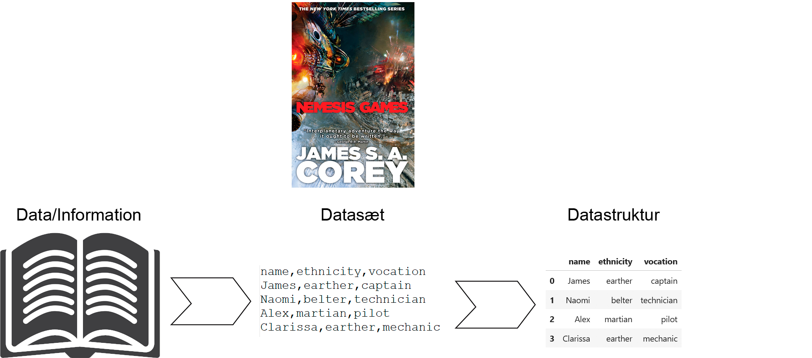
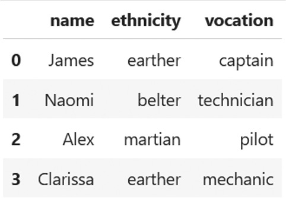
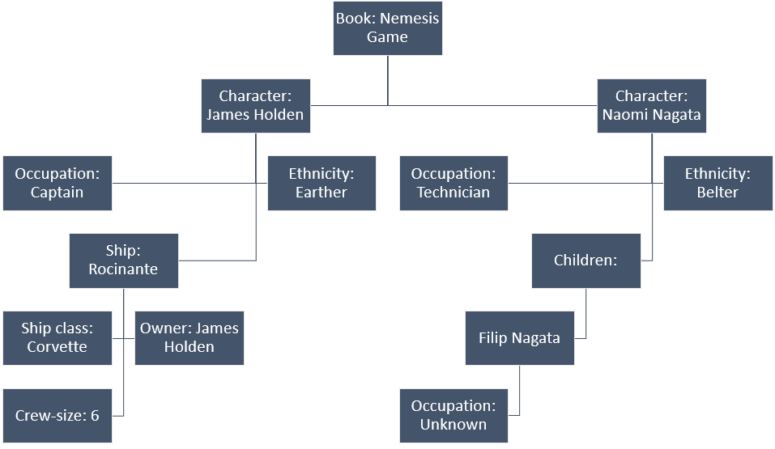

# Dataformater og datastrukturer

## Data -> Datasæt -> Datastruktur



## Relationel datastruktur

- Data i tabeller
- Hver tabel har kun 2 dimensioner (rækker og kolonner)



## Hierarkisk datastruktur

- Data i træ-lignende struktur
- Ikke bundet til 2 dimensioner (hver gren kan have så mange undergrene, som  der er behov for)



## Hyppige datafilformater: .csv

- csv: "Comma-separated values"
- Én række per observation
- Værdier adskilt med kommaer
- To-dimensionel datastruktur

```
name,ethnicity,vocation
James,earther,captain
Naomi,belter,technician
Alex,martian,pilot
Clarissa,earther,mechanic
```

## Hyppige datafilformater: .json

- Hierarkisk dataformat
- Værdier i nøgle-værdi par
- Flere "grene" kan tilføjes

```
{'Nemesis Games': {
    "Characters": {
        "James Holden": {
            "Occupation": "Captain", 
            "Ethnicity": "Earther", 
            "Ship": {
                "Name": "Rocinante",
                "Class": "Corvette",
                "Owner": "James Holden",
                "Crew-size": 6
            }
        },
        "Naomi Nagata": {
            "Occupation": "Technician", 
            "Ethnicity": "Belter",
            "Children": {
                "Filip Nagata": {
                    "Name": "Filip Nagata",
                    "Occupation": "Unknown"
                }
            }
        }
    }
}
```

## Datastruktur i Python: Liste af lister


```python
names = ["James", "Naomi", "Alex", "Clarissa"]
ethnicities = ["earther", "belter", "martian", "earter"]
vocation = ["captain", "technician", "pilot", "mechanic"]

data = [names, ethnicities, vocation]
```


```python
data
```


    [['James', 'Naomi', 'Alex', 'Clarissa'],
     ['earther', 'belter', 'martian', 'earter'],
     ['captain', 'technician', 'pilot', 'mechanic']]


```python
[items[0] for items in data]
```


    ['James', 'earther', 'captain']


## Datastruktur i Python: Dictionary (JSON)


```python
data = {
    "James": {"ethnicity": "earther", "vocation": "captain"},
    "Naomi": {"ethnicity": "belter", "vocation": "technician"},
    "Alex": {"ethnicity": "martian", "vocation": "pilot"},
    "Clarissa": {"ethnicity": "earther", "vocation": "mechanic"},
}
```


```python
data
```


    {'James': {'ethnicity': 'earther', 'vocation': 'captain'},
     'Naomi': {'ethnicity': 'belter', 'vocation': 'technician'},
     'Alex': {'ethnicity': 'martian', 'vocation': 'pilot'},
     'Clarissa': {'ethnicity': 'earther', 'vocation': 'mechanic'}}


```python
data["James"]
```


    {'ethnicity': 'earther', 'vocation': 'captain'}


## Datastruktur i Python: Liste af dictionaries (JSON records)


```python
data = [
    {"name": "James", "ethnicity": "earther", "vocation": "captain"},
    {"name": "Naomi", "ethnicity": "belter", "vocation": "technician"},
    {"name": "Alex", "ethnicity": "martian", "vocation": "pilot"},
    {"name": "Clarissa", "ethnicity": "earther", "vocation": "mechanic"},
]
```


```python
data
```


    [{'name': 'James', 'ethnicity': 'earther', 'vocation': 'captain'},
     {'name': 'Naomi', 'ethnicity': 'belter', 'vocation': 'technician'},
     {'name': 'Alex', 'ethnicity': 'martian', 'vocation': 'pilot'},
     {'name': 'Clarissa', 'ethnicity': 'earther', 'vocation': 'mechanic'}]


```python
data[0]
```


    {'name': 'James', 'ethnicity': 'earther', 'vocation': 'captain'}


## Datastruktur i Python: (pandas) Data frame


```python
import pandas as pd

data = pd.DataFrame.from_records(data)
```


```python
data
```


<div>
<style scoped>
    .dataframe tbody tr th:only-of-type {
        vertical-align: middle;
    }

    .dataframe tbody tr th {
        vertical-align: top;
    }

    .dataframe thead th {
        text-align: right;
    }
</style>
<table border="1" class="dataframe">
  <thead>
    <tr style="text-align: right;">
      <th></th>
      <th>name</th>
      <th>ethnicity</th>
      <th>vocation</th>
    </tr>
  </thead>
  <tbody>
    <tr>
      <th>0</th>
      <td>James</td>
      <td>earther</td>
      <td>captain</td>
    </tr>
    <tr>
      <th>1</th>
      <td>Naomi</td>
      <td>belter</td>
      <td>technician</td>
    </tr>
    <tr>
      <th>2</th>
      <td>Alex</td>
      <td>martian</td>
      <td>pilot</td>
    </tr>
    <tr>
      <th>3</th>
      <td>Clarissa</td>
      <td>earther</td>
      <td>mechanic</td>
    </tr>
  </tbody>
</table>
</div>


```python
data.loc[0, :]
```


    name           James
    ethnicity    earther
    vocation     captain
    Name: 0, dtype: object


## ØVELSE: Datastrukturer i Python

Udled relevante oplysninger af nedenstående sætninger og sæt dem i en datastruktur, som du selv synes giver mening. Man skal kunne kalde alle oplysninger frem ved at kalde èn variabel.

    For at blive klogere på deres kundebase, har SuperGroce ansat en konsulent til at observere, hvad kunderne køber i deres supermarked. Der blev observeret følgende:

    Emily, en 32-årig grafisk designer, fyldte sin kurv med avocadoer, mandelmælk, grønkål, quinoa og mørk chokolade, mens hendes loyale golden retriever, Max, tålmodigt ventede ved hendes side.

    Anders, en 45-årig arkæolog, købte fin-spidsede penne, kaffebønner, pitabrød og hummus, mens han forestillede sig sin aften med forskning sammen med sin nysgerrige papegøje, Luna.

    Liam, en 28-årig fitness-træner, greb hurtigt kyllingebryster, spinat, proteinbarer, bananer og græsk yoghurt. Han kunne ikke vente med at komme i træningscenteret efter at have taget sin energiske australske hyrdehund, Bella, med på en løbetur.

    60-årig pensionist Eleanor samlede i sin kurv tomater, mozzarella, basilikum, olivenolie og baguetter for at skabe hendes signaturret, caprese-salat, alt imens hendes kat, Whiskers, slappede af i hendes indkøbsvogn.

    Pavel, en 42-årig børnelæge, valgte omhyggeligt babymad, bleer, æblemos, gulerødder og fuldkornskiks og forventede en weekend sammen med familien.

    Alex, en 19-årig universitetsstuderende, fyldte op med instant nudler, energidrikke, mikrobølgepopcorn, peanutbutter og brød. Sene studie-sessioner og hans stille guldfisk, Bubbles, ventede hjemme på kollegieværelset.

    Kokken Ramirez, en 50-årig kulinarisk ekspert, gik gennem gangene og valgte frisk basilikum, modne tomater, hvidløg, pasta og olivenolie for at tilberede en skøn pastaret, alt imens hans frække kæledyrsilder, Tango, kiggede ud fra hans skuldertaske.

    35-årig astronaut Thomas tog astronaut-is, tørret frugt, proteinbarer, vakuum-pakket kylling og tortillas i sin kurv.

    Sarah, en 25-årig romanforfatter, overvejede sine plot-ideer, mens hun valgte sort te, honning, mandler, blåbær og mørk chokolade, forestillede sig en hyggelig skrive-session forude, med hendes pjuskede kæledyrskat, Oliver, puttet op tæt ved.

## ØVELSE: Datastrukturer i Python

Udled af data hvilke kæledyr personerne over 40 år har.

# Opsummering

- Data kan struktureres i forskellige formater og strukturer
    - *Relationel* datastruktur er data i tabeller, som er begrænset til to dimensioner
    - *Hierarkisk* datastruktur er data i træ-lignende struktur
    - Valg af datastruktur hænger sammen med, hvad data skal bruges til
