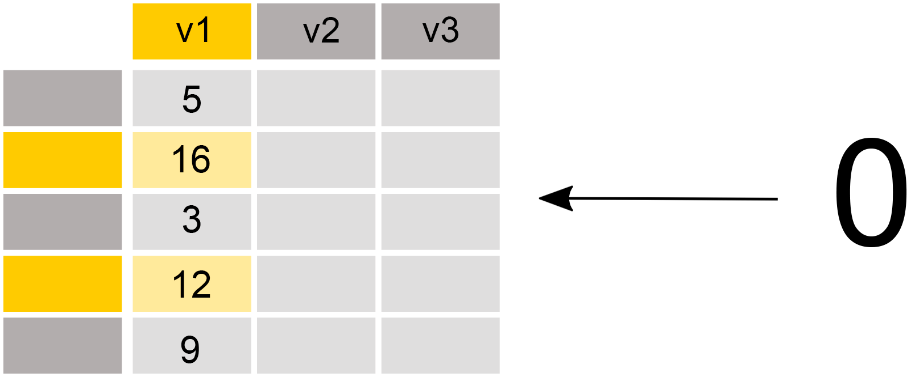
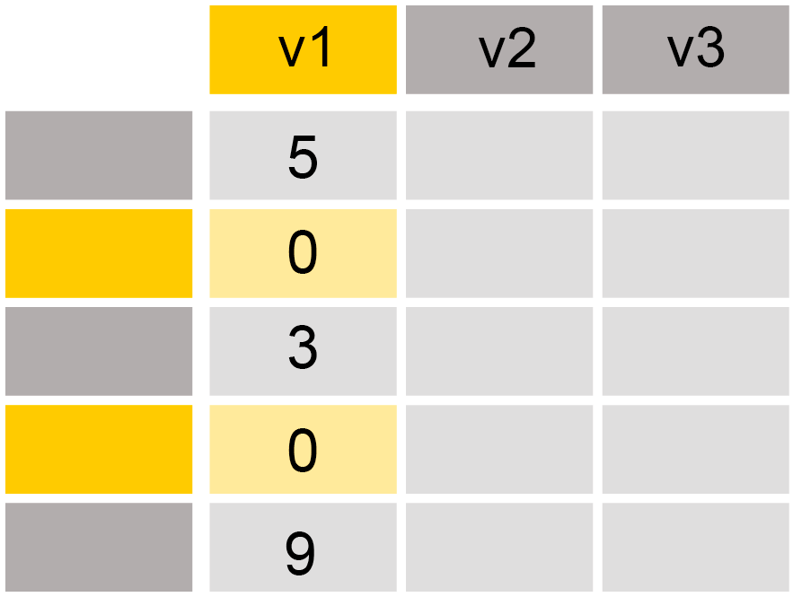

# Introduktion til pandas data frames

## Program

- Hvad er en (pandas) data frame?
- Indlæsning af data
- Udforskning af data
- Basal datahåndtering

---

## Hvad er en (pandas) data frame?

- En datastruktur til tabeldata i python (en repræsentation af data)

{width=45%}

- Hver række og kolonne har et *index*
- Rækker typisk identificeret ved *index* (rækkenummer - men kan også være andet!)
- Kolonner typisk identificeret ved kolonnenavn

---

### Hver kolonne i en data frame er en `Series`

- `Series` et enkeltkolonne-format i pandas
- Sammenlignet med en python liste, kan en `Series` kun have én type data
- Indexes i en `Series` behøver ikke starte ved 0

{width=20%}

---

## Fra data til data frame

- En data frame er blot en repræsentation af data i python
- Mange dataformater kan konverteres til en data frame
- Data frames er brugbare til mange former for analyse

Eksempler på filer, som kan læses til data frames (hvis i korrekt format!): 
- .csv
- .json
- .xls (Excel)
- .dta (Stata)
- .sas7bdat (SAS)

---
layout: center
---

# Introduktion til pandas data frames (live coding)

---
layout: center
---

# Udforskning af data (live coding)

---
layout: section
---

# Basal datahåndtering i pandas

---

## Vælg kolonner


```python
eurob['polintr']
```

---

## Vælg rækker


```python
eurob[eurob['polintr'] == "Low"] #boolean indexing
```

---

## Subsetting med `.loc[]` og `.iloc[]` (specifikke rækker og kolonner)


```python
eurob.loc[eurob['polintr'] == "Low", ['polintr', 'd10']]
```

---

## Subsetting med `.loc[]` og `.iloc[]` 

- `.loc[]`: "label-based location" (baseret på navngivningen af rækker og kolonner)
- `.iloc[]`: "index-based location" (baseret på index for rækker og kolonner)

**Syntax:**

`.loc[rows,columns]`

- `rows` kan specificeres som rækkenavne eller via betingelser ("boolean indexing")
- `columns` kan specificeres som liste af kolonnenavne

---

## Rekodning med `.loc`

- Tænk rekodning som, at man lokaliserer specifikke dele af data, som overskrives med en værdi

{width=40% lazy}

```python
df.loc[df['v1'] > 10, 'v1'] = 0
```

{width=25% lazy}

---

## Rekodning med mappings

- Ved rekodning af kategorier, kan det være besværligt at bruge `.loc[]`
- Alternativt kan man bruge en *mapping*, hvor man angiver, hvilke værdier der skal erstattes med hvad
- En mapping kan betragtes som en form for "søg-og-erstat" skema, som man anvender på en kolonne
- Mapping laves som dictionary med gammel værdi som nøgle og den nye værdi som key:

```
mapping = {"old value x": "new value x", "old value y": "new value y"}
```

- Mapping kan bruges til at erstatte værdier i en kolonne (eller `Series`) med metoden `.replace()`

---

## Rekodning med mappings - eksempel

```python
qb1_map = {"Very important": "Important", 
          "Fairly important": "Important", 
          "Not very important": "Not important",
          "Not at all important": "Not important",
          "Don't know (SPONTANEOUS)": np.nan}

eurob['qb1_bin'] = eurob['qb1'].replace(qb1_map)
```

---

# Opsummering

- Pandas data frames er en datastruktur i python til at arbejde med data i tabeller
- En kolonne i en data frame kaldes en `Series`
- Split-apply-combine metoder kan bruges til at opsummere og filtere på gruppeniveau (`.groupby()`)
- `.loc[]` bruges til både subsetting og rekodning af data frames

---
layout: center
---

# LAB ØVELSE: Datahåndtering i Python
