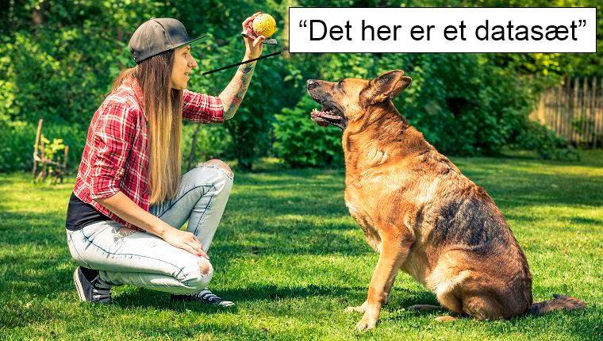
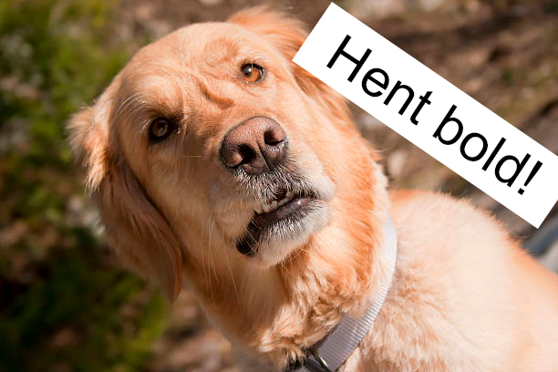
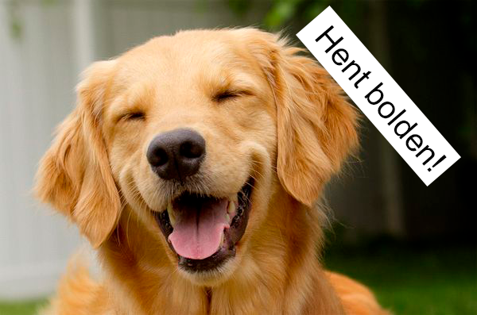
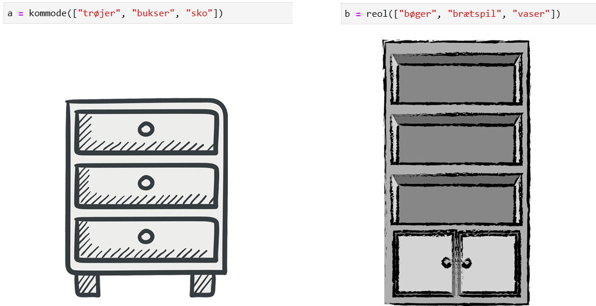

# Introduktion til Python I

## Program

- Hvad er Python? (opfølgning fra e-kursus)
- Brug af JupyterLab på UCloud
- Introduktion til pandas dataframes
- Datahåndtering med pandas
- Opsummering af data med pandas

---

## Hvad er Python?

- Python som programmeringssprog 
- Python som fortolker
- Man arbejder med Python gennem kommandoer, som evalueres
- "Objekt-orienteret": Alt defineres som "variable", som kan bruges til forskellige formål afhængigt af typen/klassen

---

## Python som sprog

Begrænset vokabular - resten "opdigtes"!

<v-click>
```
and       del       global     not    with
as        elif      if         or    yield
assert    else      import     pass
break     except    in         raise
class     finally   is         return
continue  for       lambda     try
def       from      nonlocal   while
```
</v-click>

---

## Python som fortolker

Kommandoer, som er skrevet i Python, evalueres af en "Python-fortolker".

Meget bogstaveligt sprog: Der gives en fejl, hvis kommandoen ikke er forstået.

---




```python
bolden = [2, 4, 6, 10, 21]
```

---

{width=50% lazy}


```python
print(bold)
```

<v-click>

```python
    ---------------------------------------------------------------------------
    NameError: name 'bold' is not defined
```

</v-click>

---

{width=60% lazy}


```python
print(bolden)
```

```python
[2, 4, 6, 10, 21]
```

---

## Python som "objekt-orienteret"

Man interagerer med Python ved at definere og redefinere *objekter*.

*Objekter* defineres som *variable* - Blot et navn til at kalde objektet frem!

Alle *variable* er en eller anden *class*.

*Class* sætter betingelser for, hvad *variablen* kan.

---

## Classes



---

```python
b.nederste_hylde
```
<v-click>
```python
'vaser'
```
</v-click>

<v-click>
```python
b.nederste_skuffe
```
</v-click>

<v-click>

```python
    ---------------------------------------------------------------------------
    
    AttributeError                            Traceback (most recent call last)
    
    Cell In[7], line 1
    ----> 1 b.nederste_skuffe


    AttributeError: 'reol' object has no attribute 'nederste_skuffe'
```

</v-click>

---
layout: center
---

# Opfølgning fra e-kursus (quiz)

---
layout: center
---

# Opstart af UCloud (live-coding)

---
layout: center
---

## FÆLLES ØVELSE: Simpel problemløsning med Python

Hvordan kan vi lave en funktion, der udregner arealet af en cirkel ud fra en given radius?

$A = \pi * r^2$

---

# Opsummering

- Python er et programmeringssprog og en fortolker
- Python *variable* er navne, man bruger til at kalde information frem
- Variable har altid en eller anden *class*
