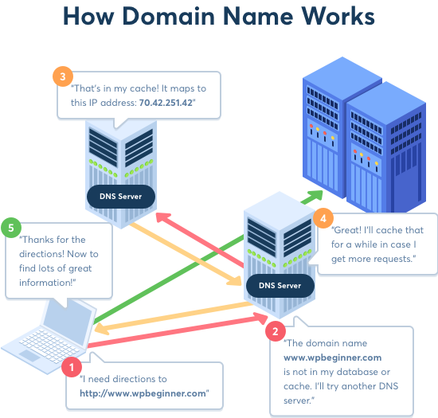
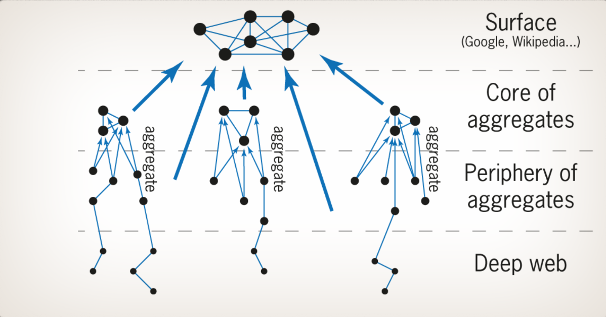

# Scraping og API-kald i Python

## Program

- Opfølgning fra sidste undervisningsgang
- Introduktion til web scraping
- Lidt om internettet og HTML
- At tilgå internettet med Python ("requests" i Python)
- API-kald i Python
- Scraping af HTML med `BeautifulSoup`
- Introduktion til crawlers med `scrapy`

---

# Opfølgning fra sidste undervisningsgang

## Hvad er web scraping?

"Web scraping" er en paraplybetegnelse for (primært) automatiserede måder at indsamle information fra internettet ("the web"). Typisk er der tale om indsamling, som *ikke* er foregået manuelt via browser.

"Crawling", "scraping" og "spiders" er alle former for scraping. Programmer og scripts til scraping omtale også som "(ro)bots".

At arbejde med web scraping involverer både indsamling af rådata fra internettet og håndtering og konvertering af rådata til en håndterbar datastruktur.

---

## En kort introduktion til internettet

På dansk bruges ordet "internettet" typisk til at dække over flere ting: både infrastrukturen, der skaber koblingen mellem maskinerne ("har du internet?") samt indholdet på hjemmesider, som tilgås via browser ("jeg fandt det her på internettet"). På den måde kan man nemt glemme, at internettet består af mange komponenter:

<v-click>

**"The internet"**: Et globalt system af forbundne computere, server og andre maskiner.
- "Internet" er en sammentrækning af "interconnected network"

</v-click>

<v-click>

**(World Wide) Web (WWW)**: En samling af ressourcer og materiale, som er gjort tilgængeligt via internettet.
- "The web" kan betragtes som de "navigérbare" og offentlige dele af internettet. 

</v-click>

---

## En kort introduktion til internettet

**IP**: "internet protocol" - en unik adresse på internettet
- Hver maskine på internettet har et unikt id i form af en IP-addresse (fx 127.28.115.253)

**URL**: Unik og menneskelig læsbar adresse til en server på internettet. 
- Forkortelse for "uniform ressource locators"

**Trafik på internettet**
- Når man tilgår internettet via "the web", skaber man forbindelse til andre maskiner/servere for at hente information.
- Koblinger mellem IP-adresser og URL'er håndteres af DNS servere (DNS: Domain Name System)

---

## En kort introduktion til internettet

{width=45% lazy}

*Opte Project 2005*

---

## En kort introduktion til internettet

- Internettet er ikke en forbindelse mellem én computer og én central server. Det er et netværk med mange forbindelser og afhængigheder.

{width=40% lazy}

<v-click>

*Konsekvens*: Ingen fælles "telefonbog" for internettet.

</v-click>

---

## Legaliteten af web scraping

**Web scraping og copyright**

- Information og materials, som virksomheder, organisationer, privatpersoner mm. lægger på offentligt tilgængelige hjemmesider er stadig ejet af disse entiteter!
- Mange hjemmesider har brugsbetingelser, der frabeder eller forbyder sig web scraping (da man nemt kan stjæle andres materiale på denne måde)

---

## Legaliteten af web scraping

**Web scraping og persondata**

- Data på sociale medier er en gevaldig gråzone ift. persondata
- Som udgangspunkt har man hjemmel til at behandle data, som personer har frivilligt har gjort offentligt tilgængeligt
- *MEN:* Hvornår kan noget siges at være "offentligt" på sociale medier, og er personen opmærksom på, at de har gjort det offentligt?
- Offentliggjort persondata er i øvrigt stadig persondata, så krav til opbevaring og oplysningspligt gælder i princippet stadig

Hjemmesider som X, Instagram, Redddit og Facebook har i øvrigt brugsbetingelser (og sikkerhedsforanstaltninger i øvrigt), der forhindrer og forbyder automatisk indsamling af deres data.

---

## Legaliteten af web scraping

**Web scraping og "hacking"**

- Indholdet fra en hjemmeside befinder sig altid på en server, som er ejet af nogen.
- Hver gang man besøger en hjemmeside, sender man en henvendelse, som skal bearbejdes af serveren
- Jo flere henvendelser, jo mere belastet bliver serveren (tænk på når der er årsopgørelse)
- Python gør det nemt for os at skrive kommandoer, som sender ufatteligt mange henvendelser på meget kort tid.

<v-click>

***Dette kan betragtes som et angreb og et forsøg på at overbelaste serveren, hvilket er ulovligt!!***

</v-click>

---

## robots.txt

"robots.txt" er en gammel konvention til at sætte betingelser for, hvad en bot (altså en scraper) må på hjemmesiden.

Den skrives i blokke med følgende:
- "User-agent": Hvem gælder betingelserne for? (typisk navnet på en bestemt bot, en type browser eller andet)
    - "*" betyder alle
- "Disallow": Hvilke dele af hjemmesiden, må bots ikke tilgå?
    - "/" betyder hele hjemmesiden
    - "Disallow" vægter højere end "Allow"
- "Allow": Hvilke dele af hjemmesiden, må bots gerne tilgå? (hvis ikke angivet, er alt ikke listet under "Disallow" tilladt)

Det er ikke et juridisk dokument, så man kan ikke retsforfølges på nogen måde for ikke at følge robots.txt, men typisk hænger robots.txt sammen med brugsbetingelserne (som man i nogen tilfælde kan retsforfølges på baggrund af).

### Eksempel på robots.txt

```
User-agent: *
Disallow: /lyricsdb/
Disallow: /song/
Allow: /

User-agent: 008
Disallow: /
```

---

## At tilgå internettet i Python

To skridt involveret i at samle data fra internettet:

**1. Send (http) request (GET eller POST)**

**2. Behandl indhold**
- For scraping: Kildekode (HTML)
- For API'er: Afhænger af API (ofte i JSON format)
  

<v-click>

Ved API'er bruger man længst tid på 1 (hvordan virker API'en, og hvordan formulerer jeg den rigtige forespørgsel?)

</v-click>

<v-click>

Ved scraping bruger man længst tid på 2 (hvordan sorterer jeg i hjemmesidens kildekode?)

</v-click>

---

## HTTP requests


<v-click>

**Request**
- Det, som vi afsender
- GET requests: Typisk brugt for at *anmode* om information (API og browser)
- POST requests: Typisk brugt for at *tilføje* noget
    - Grundet begrænsninger ved GET requests, bruges POST requests også nogen gange til at hente information fra API'er

</v-click>

<v-click>

**Response**
- Det, som returneres
- Data af en eller anden form - afhænger af modtagende server

</v-click>

---

## Statuskoder

En HTTP request returnerer altid en statuskode.

- Statuskode der starter med 2 eller 3: Request successful
    - 200 = "OK"
- Statuskode der starter med 4: Request har fejlet ("client-side", fx 404).
- Statuskode der starter med 5: Request har fejlet (server-side)

---

## Requests med `requests`

`requests` indeholder funktioner til at sende HTTP requests.

En browser sender en GET request, når den skal "hente" en hjemmeside:


```python
import requests

r = requests.get("https://www.aau.dk")
```

<v-click>

`r` er nu en "response" class med forskellige attributter; fx `.status_code`:


```python
r.status_code
```

    200

</v-click>

---

## Requests med `requests`

`.content` giver indholdet (her HTML kildekode):


```python
r.content[0:1000]
```

```
    b'<!DOCTYPE html><html><head><link rel="stylesheet" data-href="https://fonts.googleapis.com/css2?family=Barlow:ital,wght@0,100;0,200;0,300;0,400;0,500;0,600;0,700;0,800;0,900;1,100;1,200;1,300;1,400;1,500;1,600;1,700;1,800;1,900&amp;family=Montserrat:ital,wght@0,100;0,200;0,300;0,400;0,500;0,600;0,700;0,800;0,900;1,100;1,200;1,300;1,400;1,500;1,600;1,700;1,800;1,900&amp;family=Space+Mono:ital,wght@0,400;0,700;1,400&amp;display=swap"/><link rel="preconnect" href="https://fonts.gstatic.com" crossorigin /><meta name="viewport" content="width=device-width"/><meta charSet="utf-8"/><title>AAU - Viden for verden - Aalborg Universitet</title><meta name="description" content="Aalborg Universitet - Problem- og projektbaseret forskning og uddannelse, der i samspil mellem AAU og omverdenen skaber viden, der forandrer verden."/><meta name="robots" content="follow, index"/><link rel="canonical" href="https://www.aau.dk/"/><meta property="og:url" content="https://www.aau.dk/"/><meta property="og:type" '
```

---

## API-kald i Python

API: Application Programming Interface - henviser generelt til system-til-system "sprog" (ikke kun databaser).

API'er er forskellige men indeholder typisk de samme delkomponenter:

**Request:** Brug af API involverer at sende HTTP request (GET eller POST).

**Endpoint:** API'er består typisk af flere *endpoints*. Disse er blot URL'er.

**Parametre:** Parametre er de *argumenter*, som endpointet accepterer. Via disse formuleres, hvad der efterspørges af API'en. 

**Autentificering:** Mange API'er kræver autentificering. Dette kan være HTTPS autentificering (brugernavn og kodeord) eller autentificering via *tokens*. Tokens er unikke nøgler, der identificerer, hvem eller hvad der laver request/henvendelse via API'en.

---

## API-kald i Python (fiktivt eksempel)

```python
endpoint = "https://api.database.com/search" # hvilken URL har API'en endpoint?

authentication = ("myuser123", "!mypass123") # autentificering - her via brugernavn og adgangskode

parameters = {"date_from": "2022-07-10", # parametre - hvilke oplysninger skal hentes
              "date_to": "2022-08-10",
              "q": "popsicles"
             }

r = requests.get(endpoint, auth = authentication, params = parameters) # send get request (bemærk at "auth" og "params" er argumenter til requests.get())
```

---
layout: center
---

# API-kald i Python (live-coding)

---

## ØVELSE: API-kald med DAWA

Brug DAWA til at finde ud af, hvor mange kommuner der har en vej med navn "Østergade".

---

## (Kort) Introduktion til HTML

Når man arbejder med "rå" web scraping, er materialet man får tilbage i form af rå kildekode.

Det ville være meget besværligt at sortere i rå kildekode, som det ser ud. 

HTML har en struktur, som kan "udnyttes" til at filtrere unødvendig information fra.

---
layout: two-cols
---

**Rå HTML**

```
    <html>
        <body>
            <div id="convo1">
                <p class="kenobi">Hello There!</p>
            </div>
            <div id="convo2">
                <p class="grievous">General Kenobi!</p>
            </div>
            <div id="convo3">
                <p class="kenobi">So Uncivilized!</p>
            </div>
        </body>
    </html>
```

<div v-click="2"> 

*Hvilken datastruktur minder rå HTML jer om?*

</div>

::right::

<v-click>

**Rendered (som vist på hjemmeside)**

Hello There!

General Kenobi!

So Uncivilized!

</v-click>


---

## (Kort) Introduktion til HTML - Tags

HTML står for "Hyper-Text Markup Language". Det bruges til at strukturere indhold på hjemmesider. 

HTML er opbygget af "tags" angivet med `<>` og `</>`. Disse fortæller hvilken type indhold, der er tale om. `<p>` er for eksempel "paragraph" (tekstafnit).
- Typiske tags: `h1` for overskrifter (og `h2`, `h3` osv.), `a` for links og `div` for "division" eller adskillelse.

HTML har en træ-lignende struktur. Tags befinder sig inde i andre tags. 
- "Siblings"/"Søskende": Tags på samme niveau 
- "Children"/"Børn": Tags under/inden i et andet tag
- "Parents"/"Forældre": Tags over/uden for et andet tag

---

## (Kort) Introduktion til HTML - Attributes

HTML bruger "attributes" til både at differentiere mellem den samme type tag og til at tilføje yderligere information til et tag.

Opbyggeren af en hjemmeside kan selv navngive attributes, men visse standarder går igen:
- `id` attribute: Giver tags unikt id (ideelt set) 
- `class` attribute: Differentierer typisk mellem forskellige tags af samme type - fx for at give forskellig styling/formatering
- `href` attribute: Indeholder URL som hyperlink refererer til (typisk en del af et `a` tag)

---

## (Kort) Introduktion til HTML - Fælles øvelse

*Uden at søge på tekstindholdet, hvordan kan vi så udlede teksten "General Kenobi" af nedenstående HTML-kode?*

```
    <html>
        <body>
            <div id="convo1">
                <p class="kenobi">Hello There!</p>
            </div>
            <div id="convo2">
                <p class="grievous">General Kenobi!</p>
            </div>
            <div id="convo3">
                <p class="kenobi">So Uncivilized!</p>
            </div>
        </body>
    </html>
```

---

## Håndtering af HTML med `BeautifulSoup`

Pakken `BeautifulSoup` gør det nemmere at håndtere og navigere i HTML kode.

Pakkens funktioner er bygget op omkring et `soup` objekt.

Pakken fungerer ved at konvertere kildekode/HTML fra en hjemmeside (en string) til et `soup` objekt.

Man kan bruge HTML tags og attributes til at navigere i et `soup` objekt - blandt andet med metoderne `.find()` og `.find_all()`

---

## Håndtering af HTML med `BeautifulSoup`

`BeautifulSoup` fungerer ved at konvertere HTML til et `soup` objekt.


```python
from bs4 import BeautifulSoup as bs

soup = bs(r.content, "html.parser") # bruger indholdet fra aau.dk - se tidligere slide
```

<v-click>
Derefter kan man bruge HTML strukturen til at navigere i kildekoden:
</v-click>

<v-click>
```python
soup.find('h1')
```
</v-click>


<v-click>

```html
<h1 class="Heading_Heading__p89D6 Heading_Heading___display__24rOw Hero_Hero_heading__1w40w Hero_Hero_heading___small__1fNfP" title=""><span class="Hero_Hero_headingLine__3eOZd">Aalborg Univer­sitet </span><span class="Hero_Hero_headingLine__3eOZd">åbner nyt iværksætter- </span><span class="Hero_Hero_headingLine__3eOZd">og innova­tionsmiljø</span></h1>
```

</v-click>


<v-click>

Selve teksten udledes med `.get_text()`: 

</v-click>

<v-click>
```python
soup.find('h1').get_text()
```

    'Aalborg Univer\xadsitet åbner nyt iværksætter- og innova\xadtionsmiljø'

</v-click>

---

## Håndtering af HTML med `BeautifulSoup`

Metoderne `.find()` og `.find_all()` bruges til at navigere i HTML.

- `.find()`: Returnerer første match som et nyt soup objekt
- `.find_all()`: Returnerer alle matches som en liste af soup objekter

<v-click>
Fordi metoderne returnerer nye soup objekter, kan man navigere i HTML'ens træstruktur:
</v-click>

<v-click>
```python
h1_soup = soup.find('h1')

span_soup = h1_soup.find('span') # span er et "barn" til h1

span_soup.get_text()
```
</v-click>


<v-click>
    'Aalborg Univer\xadsitet '
</v-click>

---

## Håndtering af HTML med `BeautifulSoup` - Attributes

`BeautifulSoup` understøtter at søge efter attributes. Attributes som `id` og `class` har sine egne argumenter:

```python
soup.find('div', class_ = 'classname')

soup.find('div', id = 'idname')
```

<v-click>
Da attributter kan være kaldt alt muligt, kan man selv specificere attribut-navnet med `attrs`-argumentet (dictionary):

```python
soup.find('div', attrs = {'some_attribute': 'attribute_value'})
```
</v-click>

---

## Håndtering af HTML med `BeautifulSoup` - Attributes

*Bemærk!:* Søgning efter attributes understøtter regular expression:


```python
import re

soup.find('div', class_ = re.compile(r'TeaserCard')).get_text()
```

<v-click>

>'Ekspertliste: FolketingsvalgRygtet svirrer om et snarligt folketingsvalg. Vi har samlet en liste over en række eksperter, som kan udtale sig om emner, der kunne blive centrale i en kommende valgkamp.Folketingsvalg'

</v-click>

---

## Håndtering af HTML med `BeautifulSoup` - "Familietræet"

`BeautifulSoup` har forskellige metoder til at navigere i HTML'ens træstruktur.

- `soup.next_sibling`/`soup.previous_sibling`: Returnerer hhv. næste eller forrige tag, som er på samme niveau som nuværende 
- `soup.parent`: Returnerer tag over tag for nuværende soup objekt
- `soup.parents`: Itererer over "stamtræet"

---
layout: center
---

# Web scraping i Python (live-coding)

---

## Introduktion til crawling

"Crawlers" eller "spiders" refererer typisk til programmer eller bots, der er bygget til at bevæge sig rundt på flere hjemmesider.

**En crawler består typisk af følgende:**
- Startbetingelser: Hvor skal crawleren starte?
- Parsing funktioner: Hvad skal crawleren gøre? (typisk en eller flere web scraping funktioner)
- Undtagelser: Hvad skal crawleren undgå?
- Slutbetingelser: Hvornår skal crawleren stoppe?

Grundet internettets opbygning, kan crawlere, der går på tværs af hjemmeider, være meget vanskelige at sætte op.

---

## Introduktion til crawling

*Crawlers bevæger sig altid mod overfladen!*



---

## Introduktion til crawling

En crawler kan sagtens sættes op med basis Python kommandoer:
- Definere scraping-funktion (`def`)
- Brug `requests` og `BeautifulSoup` til at skaffe og behandle hjemmesideindhold
- Gentag scraping, så længe der er flere links (fx med et `while` loop) 

<v-click>

En crawler kræver dog en del fejlhåndtering:

</v-click>

<v-clicks>

- Hvad skal der ske, hvis der ikke er flere links?
- Hvad skal der ske, hvis request fejler?
- Hvad skal der ske, hvis hjemmeside ikke indeholder det indhold, som scraper leder efter?
- Osv.

</v-clicks>

<v-click>

Derfor kan det ofte svare sig at bruge pakker til at bygge crawlers ud fra (fx `scrapy`).

</v-click>

---

## Introduktion til crawling - Advarsel!

*HUSK!:*


**Dette sker for *hver* henvendelse!**
- Scraping af enkelt hjemmeside: én request én gang
- Crawler: ??? requests inden for ??? tid

En crawler *skal* have forsinkelser indbygget mellem requests - ellers kan det betragtes som et angreb på server (robots.txt vil også nogen gange specificere et "crawl-delay")

---

## Introduktion til crawling

En simpel måde at skabe forsinkelser er fx med `time.sleep()`


```python
from datetime import datetime
import time

start = datetime.now()

time.sleep(5)

end = datetime.now()

print(f"Jeg ventede i {(end-start).seconds} sekunder!")
```

>Jeg ventede i 5 sekunder!


Scrapere fra `scrapy` vil dog have forsinkelse indbygget.

---
layout: center
---

# Crawling i Python (live-coding)
